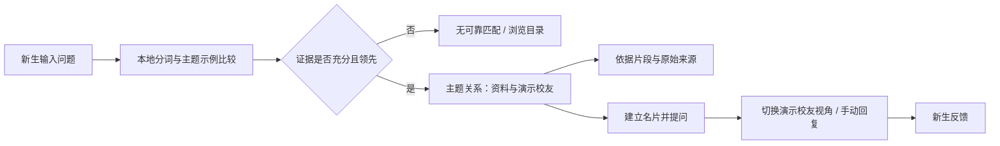
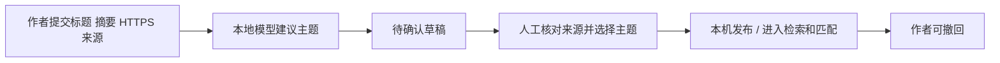
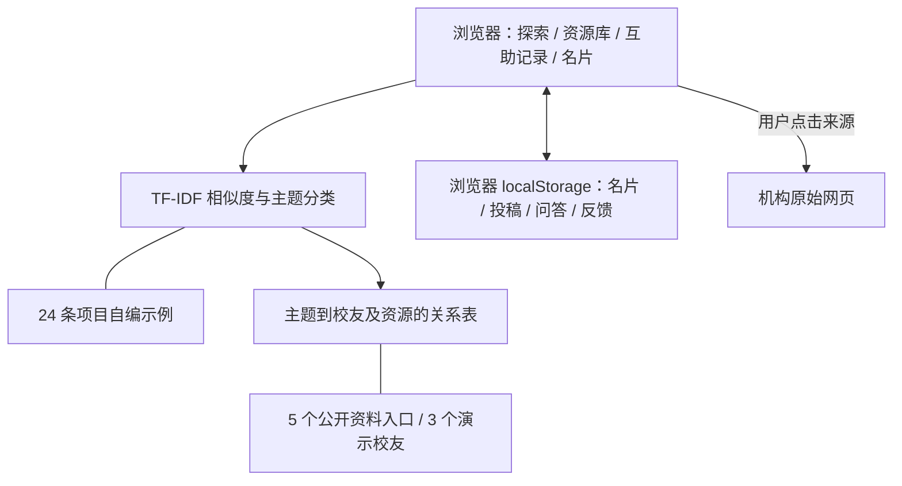

# 留光 · 当前工作流与系统架构 · v0.1.1

## 需求匹配与人工反馈

```mermaid
flowchart LR
 A[新生输入问题] --> B[本地分词与主题示例比较]
 B --> C{证据是否充分且领先}
 C -->|否| D[无可靠匹配 / 浏览目录]
 C -->|是| E[主题关系：资料与演示校友]
 E --> F[依据片段与原始来源]
 E --> G[建立名片并提问]
 G --> H[切换演示校友视角 / 手动回复]
 H --> I[新生反馈]
```

## 投稿工作流

```mermaid
flowchart LR
 A[作者提交标题 摘要 HTTPS 来源] --> B[本地模型建议主题]
 B --> C[待确认草稿]
 C --> D[人工核对来源并选择主题]
 D --> E[本机发布 / 进入检索和匹配]
 E --> F[作者可撤回]
```

## 系统边界

```mermaid
flowchart TB
 UI[浏览器：探索 / 资源库 / 互助记录 / 名片] --> ML[TF-IDF 相似度与主题分类]
 ML --- S[24 条项目自编示例]
 ML --> REL[主题到校友及资源的关系表]
 REL --- DATA[5 个公开资料入口 / 3 个演示校友]
 UI <--> LS[浏览器 localStorage：名片 / 投稿 / 问答 / 反馈]
 UI -->|用户点击来源| WEB[机构原始网页]
```

现阶段是确定性的检索和人工确认工作流，无远程推理、自治 Agent、图数据库或跨账号通讯。学校、城市和站点是首版固定上下文；当前匹配按主题，不按真实人际关系或用户画像推断。用户输入与稿件不上传。部署版、多账号隔离、管理员权限和真实校友邀请是试点所需的后续能力。
